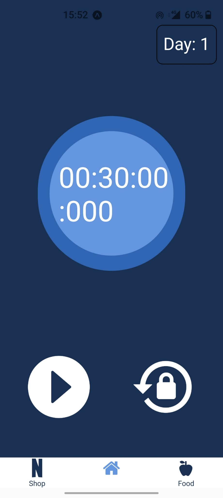
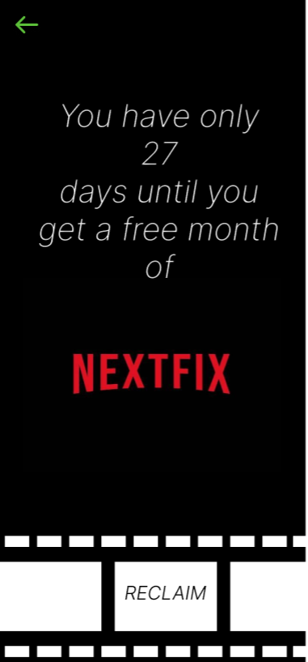
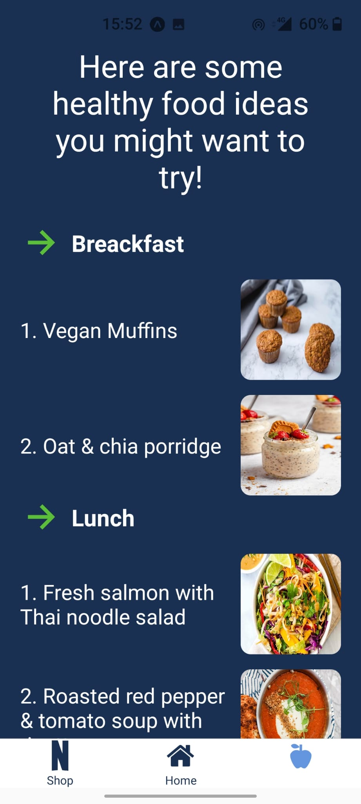

# Piratzi-Hackerton_1_Edition

It was a great experience at the hackerton organized by the Piratzi organization. My partner Andra Malaescu and I learned a lot from this experience.
Our application encourages lazy people and especially people who like series to do physical exercises.

On the main page we have a timer that checks if you do the 30 minutes of sports daily. In the future, we are thinking of connecting the application to a watch to verify that the user actually does the 30 minutes of sports.

If you exercise every day for 30 days, you can win a free month of Netflix, which you can collect from the shop.

Our application also has a nutritional part where users can see delicious and healthy food recipes.In the future, we are thinking of adding the possibility to take a picture with the camera of the dishes made at home and to receive extra points.

----------------------------
My partner and I learned a lot of new things, especially her, because it was the first time she used react native and the first time he participated in a hackathon.
We started with a brainstorming session, in which we thought of an idea, after which we made the structure in figma, and finally we brought the idea to life through code.
